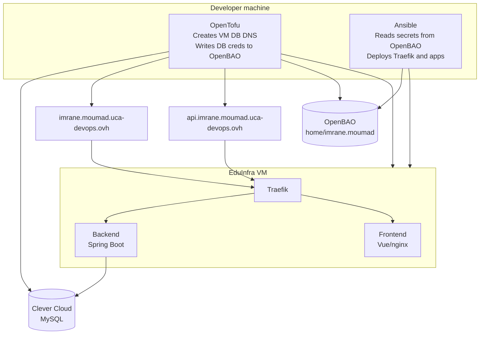

# Infrastructure & Deployment


This repository automates the infrastructure provisioning and application deployment for the **ACNHCollector** project (a Vue.js frontend + Spring Boot backend).

## 🏗️ Architecture



## 📂 Repository layout

```
infra/
├── tofu/                      # OpenTofu (Infrastructure as Code)
│   ├── providers.tf
│   ├── variables.tf
│   ├── database.tf
│   ├── vm.tf
│   ├── dns.tf
│   ├── ansible_inventory.tf
│   ├── ansible_vars.tf
│   └── outputs.tf
├── ansible/                   # Ansible (Configuration Management)
│   ├── ansible.cfg
│   ├── playbook.yml
│   ├── inventories/prod/inventory   (auto-generated)
│   └── tasks/
│       ├── load_secrets.yml
│       ├── install_docker.yml
│       ├── registry_login.yml
│       ├── network.yml
│       ├── deploy_traefik.yml
│       ├── deploy_backend.yml
│       └── deploy_frontend.yml
├── .gitlab-ci.yml             # Runs Ansible on push to main
├── load-secrets.ps1           # Windows helper (gitignored)
├── load-secrets.sh            # Linux/WSL helper (gitignored)
└── .gitignore
```

## 🔐 Secret management

All secrets live in **OpenBAO** — nothing in Git, nothing on disk long-term.

| Secret | Consumer | Loaded by |
|---|---|---|
| `CC_ORGANISATION`, `CC_OAUTH_TOKEN`, `CC_OAUTH_SECRET` | OpenTofu | `load-secrets.*` → `TF_VAR_*` env |
| `ovh_*` (4 keys) | OpenTofu | `load-secrets.*` → `TF_VAR_*` env |
| `UCA_USER_TOKEN` | OpenTofu | `load-secrets.*` → env var |
| `ssh_public_key` | OpenTofu | `load-secrets.*` → `TF_VAR_*` env |
| `GITLAB_REGISTRY_TOKEN` | Ansible | `tasks/load_secrets.yml` (REST call) |
| `MYSQL_*` (5 keys, auto-written by OpenTofu) | Ansible | `tasks/load_secrets.yml` (REST call) |

MySQL credentials are **written to OpenBAO by OpenTofu** after each `tofu apply`. Ansible always reads the current values — no manual sync.

## 🚀 Usage

### First-time setup

1. Populate OpenBAO at `home/imrane.moumad` with the keys listed above.
2. Generate an SSH keypair and upload the public key to OpenBAO as `ssh_public_key`:

```bash
ssh-keygen -t ed25519 -f ~/.ssh/tp_vm_key
```

### Loading secrets

Two equivalent helper scripts are provided (both gitignored, for local use):

| OS | Script | How to run |
|---|---|---|
| Windows | `load-secrets.ps1` | `. .\load-secrets.ps1` |
| Linux / WSL | `load-secrets.sh` | `source ./load-secrets.sh` |

Both fetch secrets from OpenBAO and export them as `TF_VAR_*`, `UCA_USER_TOKEN`, and `VAULT_TOKEN` environment variables.

If `OPENBAO_TOKEN` is not already set, the script prompts for it. You can also pass the token as an argument to skip the prompt:

```powershell
. .\load-secrets.ps1 "s.abcdef123456"
```

```bash
source ./load-secrets.sh "s.abcdef123456"
```

> ⚠️ Passing the token as an argument stores it in shell history. Use only in scripts or disposable sessions.

### Deploy the infrastructure

> Per the brief, OpenTofu is **NOT** run in CI — always run it locally.

**Windows (PowerShell):**

```powershell
. .\load-secrets.ps1
cd tofu
tofu init
tofu apply
```

**Linux / WSL (bash):**

```bash
source ./load-secrets.sh
cd tofu
tofu init
tofu apply
```

OpenTofu creates the VM, DB, DNS records, writes MySQL credentials to OpenBAO, and regenerates the Ansible inventory automatically.

### Deploy the application

Ansible runs on Linux only. Windows users should use WSL.


```bash
source ./load-secrets.sh
cd ansible
ansible-playbook playbook.yml
```

Or simply **push to `main`** on the `infra` repository — GitLab CI runs the same Ansible playbook against the VM automatically.

### Destroy

```bash
cd tofu
tofu destroy
```

## 🧩 Tech stack

| Layer | Tool |
|---|---|
| IaC | OpenTofu 1.8+ |
| Configuration Mgmt | Ansible 2.16+ |
| Secret Management | OpenBAO |
| Container Runtime | Docker |
| Reverse Proxy | Traefik v3.6 |
| CI/CD | GitLab CI (Docker-in-Docker) |
| VM Provider | EduInfra (UCA) |
| Database Provider | Clever Cloud (MySQL free tier) |
| DNS Provider | OVH |

## 🌐 Live URLs

- Frontend: http://imrane.moumad.uca-devops.ovh
- API: http://api.imrane.moumad.uca-devops.ovh

## 📌 Design notes

- EduInfra VMs have a 4-hour lifetime. After recreation, `tofu apply` refreshes the inventory and OpenBAO secrets; Ansible then redeploys.
- OpenTofu never runs in CI (teacher rule). Only the `infra` repo's CI runs Ansible against an existing VM.
- `.terraform.lock.hcl` is committed so CI uses identical provider versions.
- Each repository (`backend`, `frontend`, `infra`) has its own GitLab CI pipeline.
